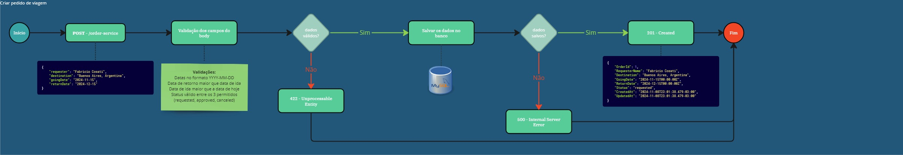
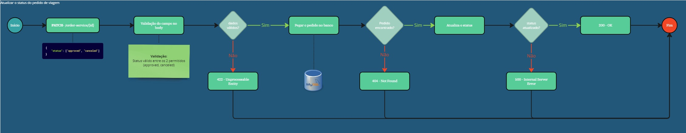
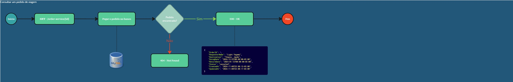
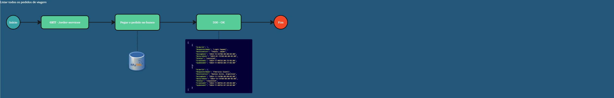

# Teste Técnico Onfly

Este é um microserviço feito em GO utilizando as tecnologias:
* **[Gin Framework](https://github.com/gin-gonic/gin)** para montar a aplicação REST
* **[MySQL](https://www.mysql.com/)** como banco de dados da aplicação
* **[Docker](https://www.docker.com/)** para montar os containers da aplicação
* **[OpenTelemetry](https://opentelemetry.io/docs/languages/go/)** para montar os logs de observabilidade da aplicação

# Como executar

**Configurando o ambiente**
---

Será necessário o **[Docker](https://www.docker.com/)** para que possa subir a aplicação sem problemas relacionados a sistema operacional ou o GO instalado na máquina. 

Ter o **[Postman](https://www.postman.com/)** instalado não é obrigatório, mas será útil para testar as requisições da aplicação mais facilmente.

**Variáveis de ambiente**
---

É necessário ter um arquivo **.env.local** na raiz do projeto, para que ele reconheça as variáveis de ambiente necessárias para o funcionamento adequado da aplicação.

Você pode utilizar os seguintes valores no .env.local para poder iniciar a aplicação:

```shell
LOGS_DIR=logs
TIME_ZONE=America%2FSao_Paulo
SERVER_PORT=:8080
ONFLY_DB_USER=user
ONFLY_DB_PASS=pass
ONFLY_DB_HOST=onfly-db
ONFLY_DB_PORT=3306
ONFLY_DB_NAME=onflydb
```

O **LOGS_DIR** será a pasta que ficará os logs de operação e observabilidade, nesse caso terá uma pasta logs na raiz do projeto

O **TIME_ZONE** será a data padrão do sistema, neste caso utilizando o horário de São Paulo

O **SERVER_PORT** será o será a porta para rodar o servidor da aplicação (Porta padrão do server, verifique se está disponível para que a aplicação rode sem problemas)

O **ONFLY_DB_USER** será o usuário do banco de dados

O **ONFLY_DB_PASS** será a senha do banco de dados

O **ONFLY_DB_HOST** será o host do banco de dados, nesse caso vamos utilizar o host da imagem do docker que será criada

O **ONFLY_DB_PORT** será a porta do banco de dados (Porta padrão do banco, verifique se está disponível para que a aplicação rode sem problemas)

O **ONFLY_DB_NAME** será o nome do banco de dados que vamos utilizar

**Executando o Docker**
---

O Docker facilitará para que o projeto seja executado corretamente, pois com ele não será necessário:

* Ter o GO instalado. O docker já configurará corretamente do Docker Hub
* Ter o AIR instalado, que é uma ferramenta de Hot Reload muito útil em ambiente de desenvolvimento, ajudando a reiniciar o servidor automaticamente.
* Ter o MySQL instalado. O docker já configurará a versão correta diretamente do Docker Hub
* Criar a tabela no banco. O docker também rodará uma **migrations** que criará a tabela automaticamente, sem que seja necessário fazer isso manualmente

OBS: O arquivo docker-compose está usando as portas 8080 para o servidor e 3306 para o banco de dados, verifique se essas portas estão livres para que a aplicação não tenha problemas.

Será necessário apenas rodar o comando abaixo para ter a aplicação funcionando.

```bash
  docker compose up -d
```

Pronto! Com isso a aplicação já está rodando.

# Testes

O projeto possui testes unitários da **Repository** para verificar se as operações com o banco utilizando GORM estão funcionando perfeitamente, além do mais utilizando **[go-sqlmock](https://github.com/DATA-DOG/go-sqlmock)** que mocka o banco de dados sem que seja necessário ter uma conexão para funcionar.

Há também o teste do **Middleware** de logs, neste caso o do log de operações, onde o middleware pega as informações da requisição e salva em uma pasta para futuras análises. Este teste verifica se o LOG foi salvo corretamente na pasta e se os atributos estão corretos.

Por fim tem os testes da **Controller** onde uma série de verificações é realizada, como ao criar um pedido de viajem por exemplo, o teste engloba tanto o caso de sucesso ao retornar 201 com o objeto na API, quanto o caso de erro, como o de validação, neste caso retornando erro 422 pela API. Há testes da controller para os 4 endpoints do projeto.

Para rodar os testes apenas digite no terminal

```bash
  go test -v ./tests
```

Para que todos os testes sejam executados.

Caso queira rodar apenas de um arquivo em específico, rode

```bash
  go test -v ./tests/repository_test.go 
```

# Informações adicionais

O microserviço possui 4 endpoints como foi solicitado na descrição da tarefa

**POST - /api/order-service**


**PATCH - /api/order-service/{id}**


**GET - /api/order-service/{id}**


**GET - /api/order-services?status={status}**



Exemplo do corpo da requisição **POST**:

```json
{
  "requester": "Light Yagami",
  "destination": "Tóquio, Japão",
  "goingDate": "2024-12-22",
  "returnDate": "2025-01-20"
}
```

No caso do POST o ID é automaticamente gerado e o status por padrão será "requested" para não ter o risco de criar um pedido de viajem que já venha aprovado ou cancelado.

Exemplo do corpo da requisição **PATCH**:

```json
{
  "status": "approved"
}
```

Também estarei disponibilizando a collection do postman e a variável de ambiente, para facilitar na hora das requisições!

**[collection](https://drive.google.com/drive/folders/1bjHgkknJoz05gOzzJZUCefQ-nHktM9xD)**